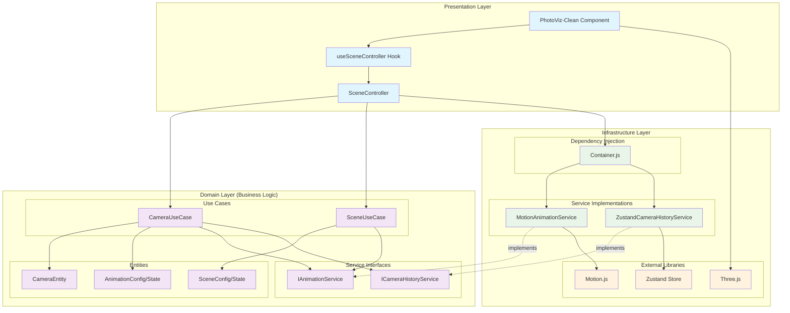
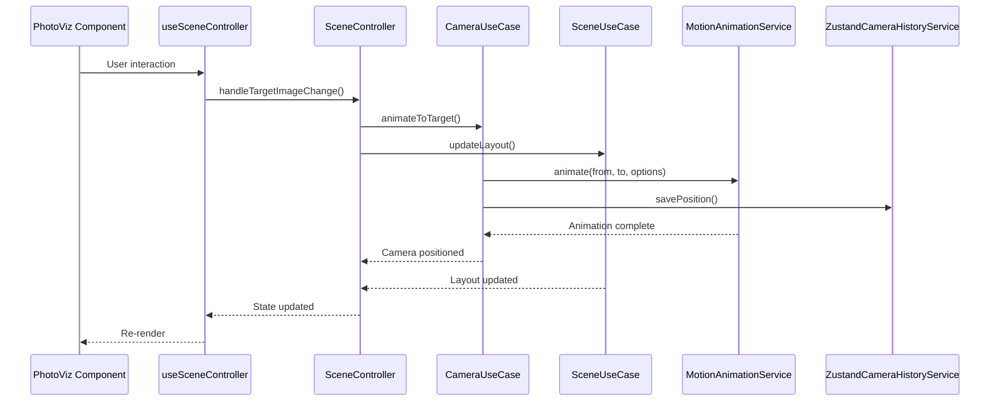
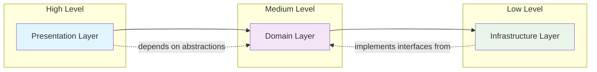
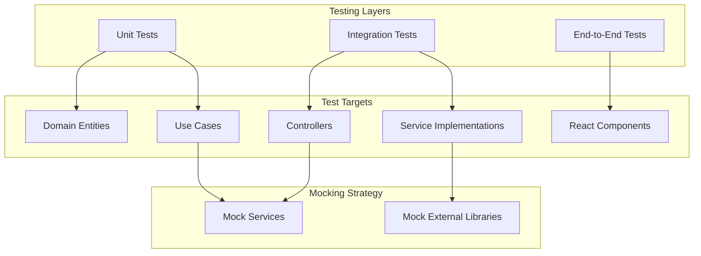

# PhotoViz Clean Architecture Diagram

```mermaid
graph TB
    %% Presentation Layer
    subgraph "Presentation Layer"
        UI[PhotoViz-Clean Component]
        Hook[useSceneController Hook]
        Controller[SceneController]
    end

    %% Domain Layer
    subgraph "Domain Layer (Business Logic)"
        subgraph "Entities"
            Camera[CameraEntity]
            Animation[AnimationConfig/State]
            Scene[SceneConfig/State]
        end
        
        subgraph "Use Cases"
            CameraUC[CameraUseCase]
            SceneUC[SceneUseCase]
        end
        
        subgraph "Service Interfaces"
            IAnimation[IAnimationService]
            IHistory[ICameraHistoryService]
        end
    end

    %% Infrastructure Layer
    subgraph "Infrastructure Layer"
        subgraph "Service Implementations"
            MotionService[MotionAnimationService]
            ZustandService[ZustandCameraHistoryService]
        end
        
        subgraph "Dependency Injection"
            Container[Container.js]
        end
        
        subgraph "External Libraries"
            Motion[Motion.js]
            Zustand[Zustand Store]
            ThreeJS[Three.js]
        end
    end

    %% Connections - Presentation to Domain
    UI --> Hook
    Hook --> Controller
    Controller --> CameraUC
    Controller --> SceneUC

    %% Connections - Domain internal
    CameraUC --> Camera
    CameraUC --> Animation
    SceneUC --> Scene
    CameraUC --> IAnimation
    CameraUC --> IHistory
    SceneUC --> IAnimation

    %% Connections - Infrastructure implements Domain interfaces
    MotionService -.->|implements| IAnimation
    ZustandService -.->|implements| IHistory

    %% Connections - Infrastructure to External
    MotionService --> Motion
    ZustandService --> Zustand
    UI --> ThreeJS

    %% Dependency Injection
    Container --> MotionService
    Container --> ZustandService
    Controller --> Container

    %% Styling
    classDef presentation fill:#e1f5fe
    classDef domain fill:#f3e5f5
    classDef infrastructure fill:#e8f5e8
    classDef external fill:#fff3e0

    class UI,Hook,Controller presentation
    class Camera,Animation,Scene,CameraUC,SceneUC,IAnimation,IHistory domain
    class MotionService,ZustandService,Container infrastructure
    class Motion,Zustand,ThreeJS external
```

## Architecture Flow Diagram

```mermaid
sequenceDiagram
    participant UI as PhotoViz Component
    participant Hook as useSceneController
    participant Controller as SceneController
    participant CameraUC as CameraUseCase
    participant SceneUC as SceneUseCase
    participant AnimService as MotionAnimationService
    participant HistService as ZustandCameraHistoryService

    UI->>Hook: User interaction
    Hook->>Controller: handleTargetImageChange()
    Controller->>CameraUC: animateToTarget()
    Controller->>SceneUC: updateLayout()
    
    CameraUC->>AnimService: animate(from, to, options)
    CameraUC->>HistService: savePosition()
    
    AnimService-->>CameraUC: Animation complete
    CameraUC-->>Controller: Camera positioned
    SceneUC-->>Controller: Layout updated
    Controller-->>Hook: State updated
    Hook-->>UI: Re-render
```

## Dependency Flow

```mermaid
graph LR
    subgraph "High Level"
        A[Presentation Layer]
    end
    
    subgraph "Medium Level"
        B[Domain Layer]
    end
    
    subgraph "Low Level"
        C[Infrastructure Layer]
    end
    
    A --> B
    B --> C
    
    A -.->|"depends on abstractions"| B
    C -.->|"implements interfaces from"| B
    
    classDef high fill:#e1f5fe
    classDef medium fill:#f3e5f5
    classDef low fill:#e8f5e8
    
    class A high
    class B medium
    class C low
```

## Testing Strategy Diagram

```mermaid
graph TD
    subgraph "Testing Layers"
        UT[Unit Tests]
        IT[Integration Tests]
        E2E[End-to-End Tests]
    end
    
    subgraph "Test Targets"
        Entities[Domain Entities]
        UseCases[Use Cases]
        Services[Service Implementations]
        Controllers[Controllers]
        Components[React Components]
    end
    
    UT --> Entities
    UT --> UseCases
    IT --> Services
    IT --> Controllers
    E2E --> Components
    
    subgraph "Mocking Strategy"
        MockServices[Mock Services]
        MockExternal[Mock External Libraries]
    end
    
    UseCases --> MockServices
    Controllers --> MockServices
    Services --> MockExternal
```
