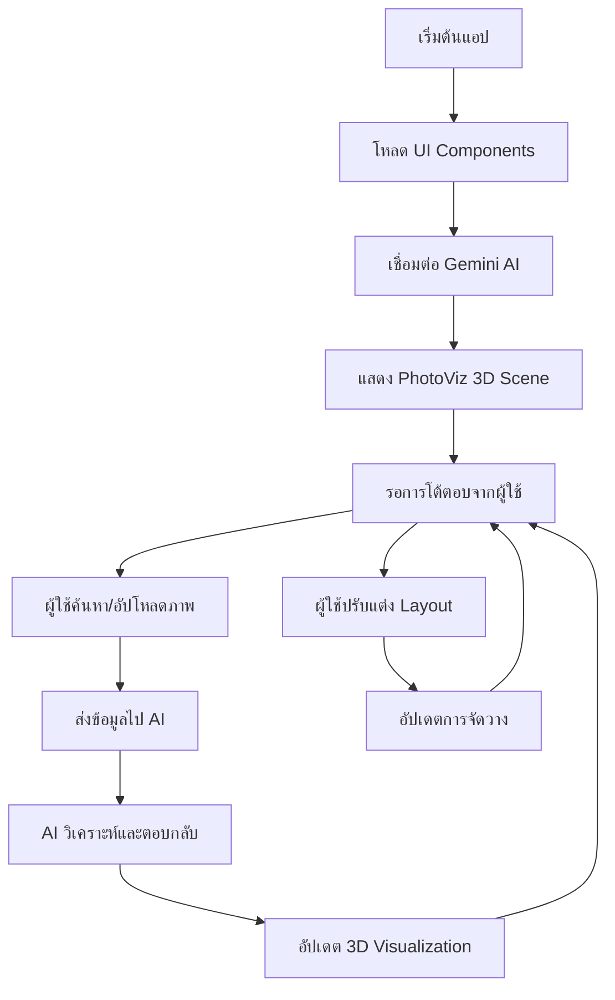

# 1. การทำงานของระบบ (System Flow)

## ภาพรวมการทำงาน



## 1. การเริ่มต้นแอปพลิเคชัน

### 1.1 การโหลดหน้าเว็บ
```javascript
// index.html โหลดและเริ่มต้น React App
// index.tsx เป็นจุดเริ่มต้นของ React
import App from './App.jsx'
ReactDOM.createRoot(document.getElementById('root')).render(<App />)
```

### 1.2 การตั้งค่า Store
```javascript
// store.js - จัดการ state ทั้งหมด
const useStore = create((set, get) => ({
  photos: [],
  query: '',
  isLoading: false,
  layout: 'grid',
  // ... state อื่นๆ
}))
```

## 2. การทำงานของ UI Components

### 2.1 App.jsx - คอมโพเนนต์หลัก
- จัดการ layout หลักของแอป
- เชื่อมต่อ PhotoViz และ Sidebar
- จัดการ search presets และ event handlers

### 2.2 PhotoViz.jsx - การแสดงผล 3D
- ใช้ React Three Fiber สร้าง 3D scene
- แสดง PhotoNode แต่ละรูปใน 3D space
- จัดการ camera controls และ lighting

### 2.3 Sidebar.jsx - แถบด้านข้าง
- แสดงข้อมูลรายละเอียด
- ควบคุมการตั้งค่าต่างๆ
- แสดงผลลัพธ์จาก AI

## 3. การทำงานของ AI Integration

### 3.1 การเชื่อมต่อ Gemini AI
```javascript
// llm.js - การตั้งค่า Google Generative AI
import { GoogleGenerativeAI } from '@google/genai'

const genAI = new GoogleGenerativeAI(process.env.GEMINI_API_KEY)
const model = genAI.getGenerativeModel({ model: "gemini-pro" })
```

### 3.2 การส่ง Query
```javascript
// actions.js - sendQuery function
export const sendQuery = async (query) => {
  // 1. อัปเดต state เป็น loading
  // 2. ส่ง prompt ไป Gemini AI
  // 3. รับผลลัพธ์และอัปเดต UI
  // 4. อัปเดต PhotoViz ด้วยข้อมูลใหม่
}
```

## 4. Data Flow

### 4.1 การไหลของข้อมูล
```
User Input → Actions → Store → Components → UI Update
     ↓
AI Processing → Response → Store Update → Re-render
```

### 4.2 State Management
- **Zustand Store**: จัดการ state แบบ centralized
- **Immer**: ช่วยในการอัปเดต state แบบ immutable
- **Auto Selectors**: สร้าง selectors อัตโนมัติ

## 5. การจัดการ Events

### 5.1 User Interactions
- **Search**: ค้นหาภาพด้วย text query
- **Layout Change**: เปลี่ยนรูปแบบการจัดวาง
- **X-Ray Mode**: เปิด/ปิดโหมดดูรายละเอียด
- **Sidebar Toggle**: แสดง/ซ่อนแถบด้านข้าง

### 5.2 3D Interactions
- **Camera Controls**: หมุน, ซูม, เลื่อน camera
- **Photo Selection**: คลิกเลือกภาพใน 3D space
- **Hover Effects**: แสดงข้อมูลเมื่อ hover

## 6. Performance Optimization

### 6.1 การโหลดแบบ Lazy
- Components โหลดเมื่อจำเป็น
- ภาพโหลดแบบ progressive

### 6.2 การจัดการ Memory
- ใช้ useCallback และ useMemo
- ทำลาย 3D objects เมื่อไม่ใช้

---
[← กลับหน้าหลัก](./README.md) | [ตัวอย่างการใช้งาน →](./2-sample-implement.md)
